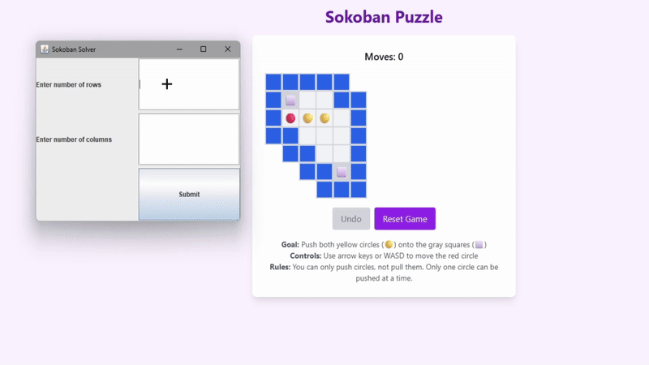

# Sokoban-Solver
A bot that finds solution for <b>Sokoban Game</b> in least moves possible, or states that its not possible.  
Doesnt require any extra Libraries, uses BFS algorithm to find in least possible moves.   
Can handle up to 30x30 grids, but unless the puzzle has few paths this will take an <b>unholy</b> amount of time and likely result in stack overflow error  
Contains an optional key presser (which uses arrow keys), delayed at 0.35 seconds per press with a 5 seconds starting delay.
  
This showcase has different GUI to what you will have  

